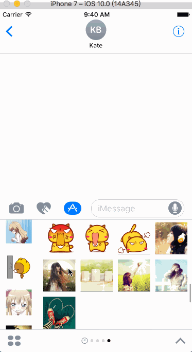
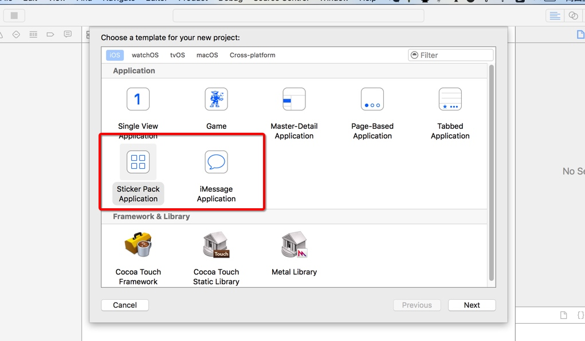
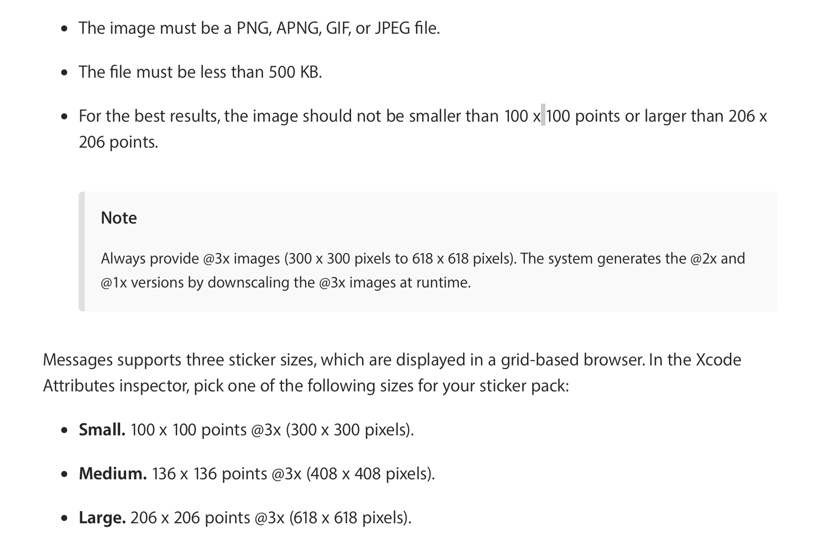
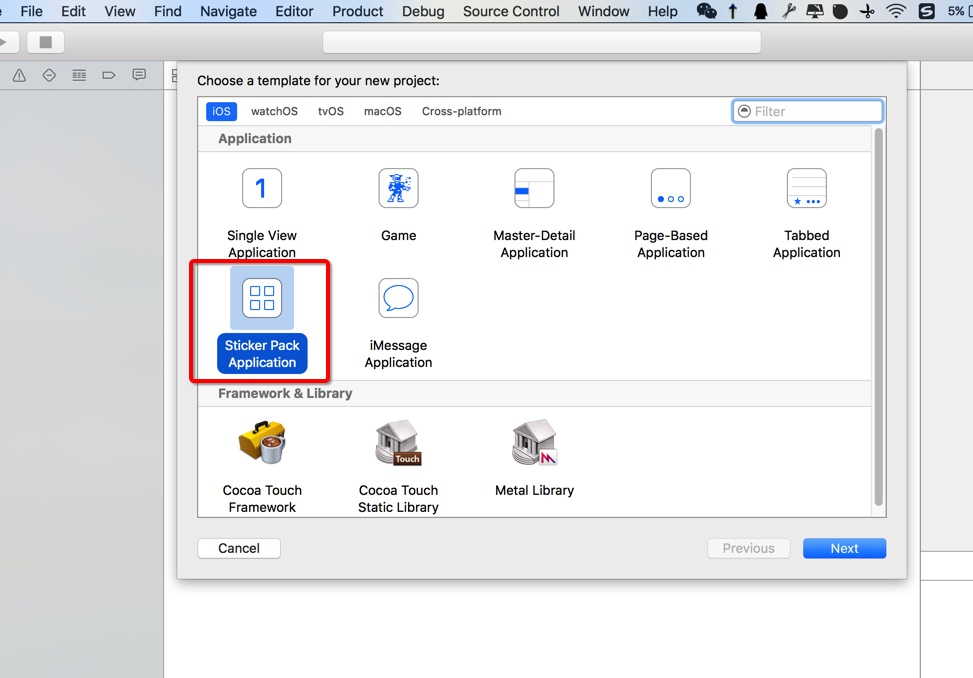
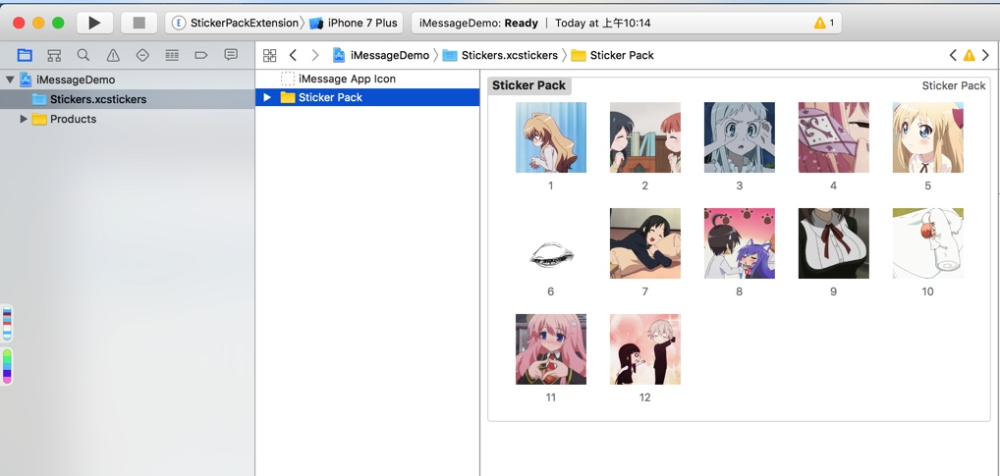
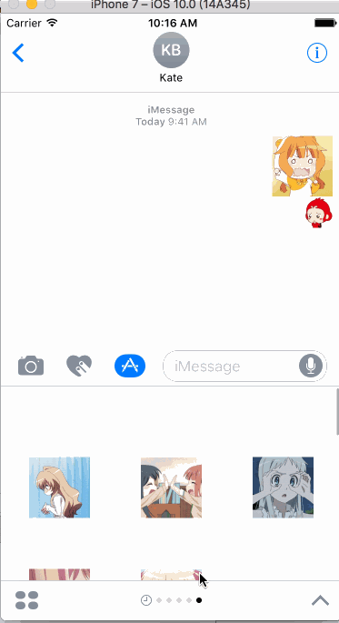
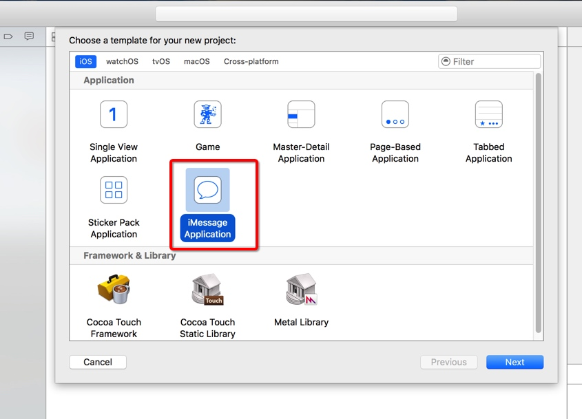
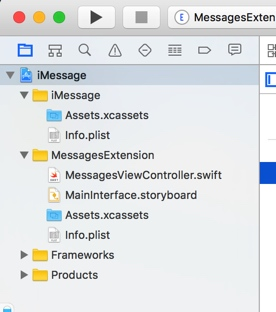
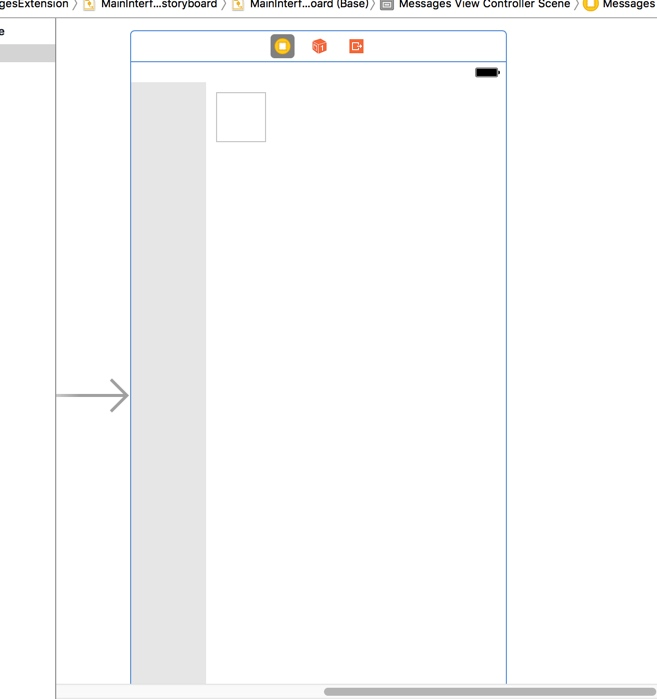
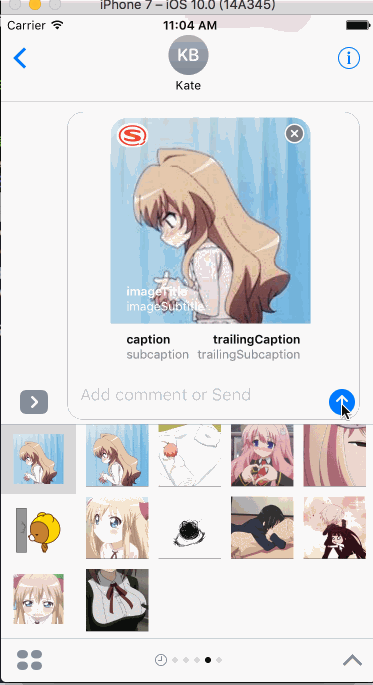

废话不多说,先 上 图,看图说话




这是仿照搜狗的iMessage表情写的一个简单的iMessageApp 

iOS10新出的功能,其实很简单 Xcode8上面新增了2个project类型,这2个都是iMessage应用,第一个很简单,只要往里面拖图片就行,不需要任何代码就能生成iMessage表情,门槛很低,不需要任何的变成经验,我们主要说第二种就是一个iMessageApp了,可以随意自定义




图片要求:




图片没有严格的要求,你只需要提供最大图像大小为每个表情在你的表情包中,如果需要缩减在某些设备上需要缩放, 系统会替你完成\

图片限制:


```
1. 图片格式必须是 PNG, APNG, JPEG, GIF 
2. 文件中images不可以大于500kb
3. image不可以小于100 x 100 pt (300 x 300 pixels)
4. image不可以大于206 x 206 pt (618 x 618 pixels)
```

苹果官方建议的表情文件大小:


```
Small: 100 x 100 pt @3x scale (300 x 300 pixel image)
Medium: 136 x 136 pt @3x scale (378 x 378 pixel image)
Large: 206 x 206 pt @3x scale (618 x 618 pixel image)
```


> 1.Messages framework 类解析,简单了解


```
MSConversation:消息会话类,使用会话对象来访问信息当前选中的消息或谈话参与者,或发送文本、贴纸、附件、或消息对象。
MSMessage:信息交互对象
MSMessageLayout:MSMessage谈话记录中的对象的外观
MSMessagesAppViewController:信息的主要视图控制器
MSMessageTemplateLayout:消息模板包括消息扩展的图标,一个图像,视频,音频文件,和一些文本元素(标题、副标题、标题、等)
MSSession:使用MSSession类来创建和更新消息。
MSSticker:消息Sticker对象。
MSStickerBrowserView:消息浏览器视图
MSStickerBrowserViewController:消息浏览器视图控制器
MSStickerView:消息Sticker视图

MSStickerBrowserViewDataSource:MSStickerBrowserViewController数据源
```

> 2.简单表情包制造


先看第一种最简单的,无需门槛,只需往里面拖图片就行了
打开Xcode, 创建一个新的工程, 选择iOS > Application > Sticker Pack Application


这个project很简单,里面只有一个Stickers文件夹,我们只需要往里面托图片就可以了,然后运行就可以了,这就完成了一个表情包的制作



cmd + R  看图说话:




> 2.第二种自己自定义UI的表情包制造


新建一个项目 这次选择 iMessage Application



新生成的project有2个文件夹,我们只需要在MessageExtension下开发,MessageViewController 对应的iMessage表情包的主入口Controller,我们在此下面开发



这个Controller是继承与UIViewController,我们可以把他当成一个普通的UIViewcontroller来开发,不过他有自己的生命周期,有兴趣的同学可以研究一下,我们这里就开始搭建UI,左边一个Tableview,右边一个CollectionView(iOS10对其做了优化,确实流畅了不少)


接下来就是代码书写,这里就很简答了,简单的实现代理和逻辑,我们只说一下发送表情:有四个API,分别是发送自定义UI表情,Stiker表情,文字,附件


```
    open func insert(_ message: MSMessage, completionHandler: (@escaping (Error?) -> Swift.Void)? = nil)
    open func insert(_ sticker: MSSticker, completionHandler: (@escaping (Error?) -> Swift.Void)? = nil)
    open func insertText(_ text: String, completionHandler: (@escaping (Error?) -> Swift.Void)? = nil)
    open func insertAttachment(_ URL: URL, withAlternateFilename filename: String?, completionHandler: (@escaping (Error?) -> Swift.Void)? = nil)
```


``` 
  func collectionView(_ collectionView: UICollectionView, didSelectItemAt indexPath: IndexPath)
    {//发送表情
        
        //1.获取当前的获取的消息会话
        guard let activeConversation = self.activeConversation else { return }
        
        //2.获取表情资源url
        let imageName = String(indexPath.section + 1) + "_" + String(indexPath.item + 1)
        guard let url = Bundle.main.url(forResource:imageName, withExtension: "gif") else { return }
        
        /*
        //3.1发送Sticker表情对象
        do
        {
            //转换成表情Sticker对象
            let sticker = try MSSticker(contentsOfFileURL: url, localizedDescription: "")
            //发送Sticker表情
            activeConversation.insert(sticker, completionHandler: nil)
            
        }
        catch
        {
            print(error)
        }
        
        
        //3.2发送MSMessage(自定义发送表情UI)
        let layout = MSMessageTemplateLayout()
        layout.image = UIImage(named: imageName + ".gif")
        layout.caption = "caption"
        layout.subcaption = "subcaption"
        layout.trailingCaption = "trailingCaption"
        layout.trailingSubcaption = "trailingSubcaption"
        layout.imageTitle = "imageTitle"
        layout.imageSubtitle = "imageSubtitle"
        
        let message = MSMessage()
        message.layout = layout
        
        activeConversation.insert(message, completionHandler: nil)
        
        
        //3.3发送文字消息
        activeConversation.insertText("https://github.com/fuaiyi/iMessageApp ", completionHandler: nil)
        */
        
        //3.4发送附件(必须是fileUrl)
        activeConversation.insertAttachment(url, withAlternateFilename: "", completionHandler: nil)//
        
        
        
    }
    
}

```
发送文字和发送附件都很简单,其中自定义UI表情要使用 MSMessageTemplateLayout 和 MSMessage 2个类


```
        if let image = UIImage(named: "CgEBa1SIDqaELZ7SAAAAALBr0dw67.jpeg"), let conversation = activeConversation
        {
            let layout = MSMessageTemplateLayout()
            layout.image = image
            layout.caption = "caption"
            layout.subcaption = "subcaption"
            layout.trailingCaption = "trailingCaption"
            layout.trailingSubcaption = "trailingSubcaption"
            layout.imageTitle = "imageTitle"
            layout.imageSubtitle = "imageSubtitle"
            
            let message = MSMessage()
            message.layout = layout
            

            conversation.insert(message, completionHandler: { (error) in
                print(error)
            })

            
        }
```
效果如下




除此之外,还可以使用MSStickerBrowserViewController来实现,这样就不用自己实现发送方法,他本身实现了发送功能,他跟tableview差不多,有一个MSStickerBrowserViewDataSource数据源,只需要传入数据源就可以了,但数据源必须是MSSticker对象


```
    func setupStickerBrowser()
    {
     
        let controller = MSStickerBrowserViewController(stickerSize: .large)
        
        addChildViewController(controller)
        view.addSubview(controller.view)
        
        controller.stickerBrowserView.backgroundColor = UIColor.green
        controller.stickerBrowserView.dataSource = self
        
        view.topAnchor.constraint(equalTo: controller.view.topAnchor).isActive = true
        view.bottomAnchor.constraint(equalTo: controller.view.bottomAnchor).isActive = true
        view.leftAnchor.constraint(equalTo: controller.view.leftAnchor).isActive = true
        view.rightAnchor.constraint(equalTo: controller.view.rightAnchor).isActive = true

    }
```

MSStickerBrowserViewDataSource方法


```
extension MessagesViewController : MSStickerBrowserViewDataSource
{
    
    func numberOfStickers(in stickerBrowserView: MSStickerBrowserView) -> Int
    {
        
        return stickers.count 
        
    }
    
    func stickerBrowserView(_ stickerBrowserView: MSStickerBrowserView, stickerAt index: Int) -> MSSticker
    {
        
        return stickers[index]
        
    }
    
}
```

[Demo传送门](https://github.com/fuaiyi/iMessageApp)

有兴趣的同学可以去参照一下[官方文档](https://developer.apple.com/reference/messages)


